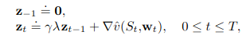
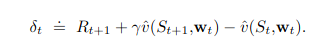
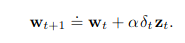
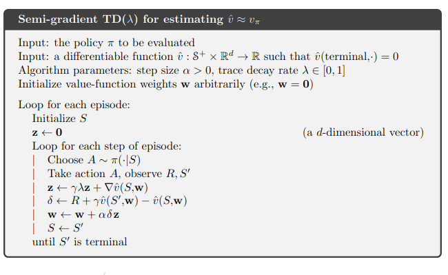
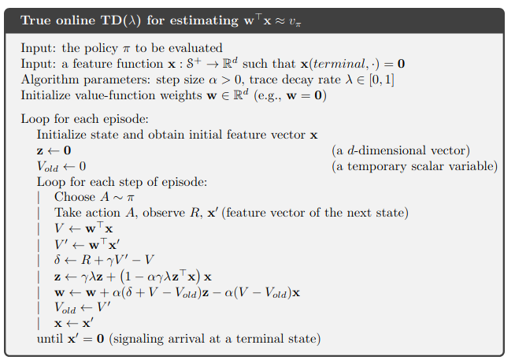
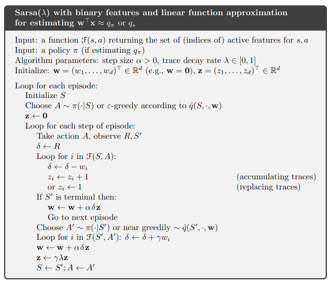

> figures are borrowe from Richard Sutton's RL book
>
# Eligibility traces methods

Eligibility traces gather methods that allow to combine TD-methods (Q-learning, Sarsa, ...)
to build more general and more efficient methods. Eligibility traces combined with TD-methods produce
a span of methods that has Monte-Carlo algorithm at one end (lambda = 1) and one-step TD-method at the other end.

Eligibility traces provide significant computation advantages over other methods by introducing a **short term memory vector** :
the *eligibility trace*.

## lambda-return

In n-step methods, the return is approximated by the first n sampled reward plus the value of state n + 1. The idea of lambda
return is to average the n-step returns for n > 0, each being weighted by lambda ** (n - 1).

## Semi-gradient TD(lambda) for estimation (not implemented)

The idea behind TD(lambda) is to use lambda-returns in an online fashion (backward view, update are performed on every step
of an episode) thanks to the eligibility trace trick. At each step the eligibility trace retains the gradient of the
learned value function that vanishes by a factor gamma * lambda. The factor gamma * lambda defines the time the *eligibility*
of each component of the parameters are kept in memory.

We define the TD-error for state value prediction (reinforcing events):

And the weight vector is updated as the following :

## True online TD(lambda) (not implemented)

## Sarsa(lambda)

Sarsa(lambda) can be deduced from TD(lambda) and vanilla Sarsa :

## True online Sarsa(lambda)

## Forward Sarsa Lambda ([True Online Temporal-Difference Learning](https://arxiv.org/abs/1512.04087))
