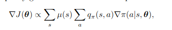
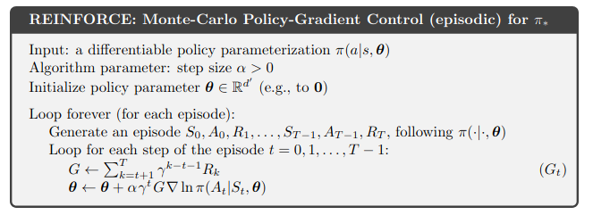
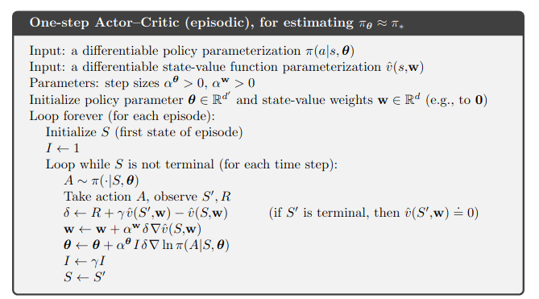

> figures are taken from Sutton's RL book

# Policy gradient algorithms

Algorithms based on the policy gradient theorem :

## Reinforce :

## Reinforce with baseline :

## Advantage Actor-Critic (A2C) :

In actor-critic methods, we use bootstrapping (i.e. updating the estimated
value of the current state with the estimated values of other states)
This technique allows reducing variance of estimates and accelerates learning.

One step actor-critic replaces the full return of REINFORCE with learned value function
baseline by the one-step return :

