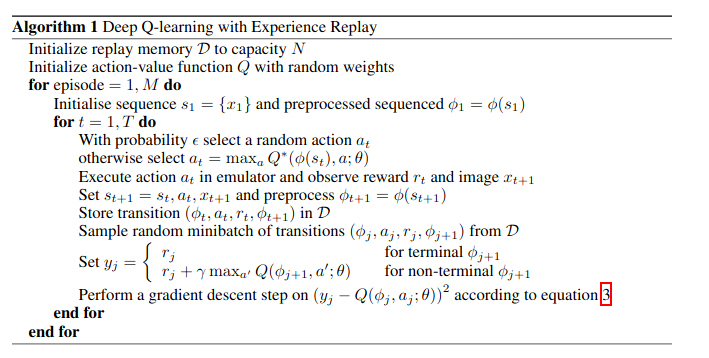
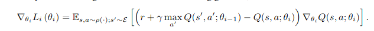
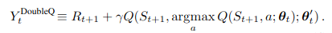

# Value Based Methods With Function Approximation

The purpose of these methods is to learn the optimal action-state value function Q* in an off-policy
fashion.
The optimal greedy policy can be derived easily from Q*.

## Deep Q-Network (DQN)

algorithm introduced by Mnih et al ([Playing Atari With Deep Reinforcement Learning](https://arxiv.org/abs/1312.5602)).

The action-state value function is represented by a neural network F mapping the state s to a vector
F(s) of size Na (Na being the cardinal of the action space). Each element of F(s) represents Q*(s, a).
The algorithm follows the Q-learning algorithm with this representation of the Q-function.
A fundamental component of Deep Q-Network is the Experience Replay Buffer. Samples are collected by playing
episodes and triplets of the form (s(t), a(t), r(t + 1)) are stored in memory.
When updating the parameters of the network, N (batch size) examples are randomly chosen from the buffer to
decorrelate the targets.

The pseudo-code of the algorithm is provided below (borrowed from Mnih et al's paper) :

The gradient descent step follows :

## Double Deep Q-Network (DDQN)

Double Q-learning has been proposed to overcome the issue of overestimation of the action-state value function.
Overestimation in Q-learning happens when building the targets of the algorithm, choosing the optimal next action and computing
its value with the same approximation function.

Van Hasselt et al ([Deep Reinforcement Learning with Double Q-learning](https://arxiv.org/abs/1509.06461)) applied
double Q-learning in the context of deep learning. First, they show that overestimation systematically occurs in Q-learning,
secondly they show that this overestimation harms performances of the model.

The modification made to the algorithm simply boils down to choosing the optimal action according to the current weights of
the model and evaluating its value according to the past weights :

