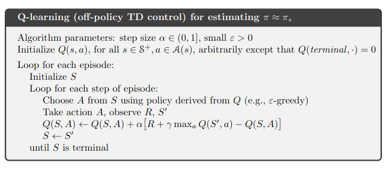
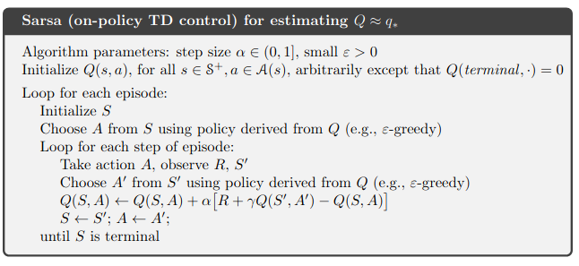
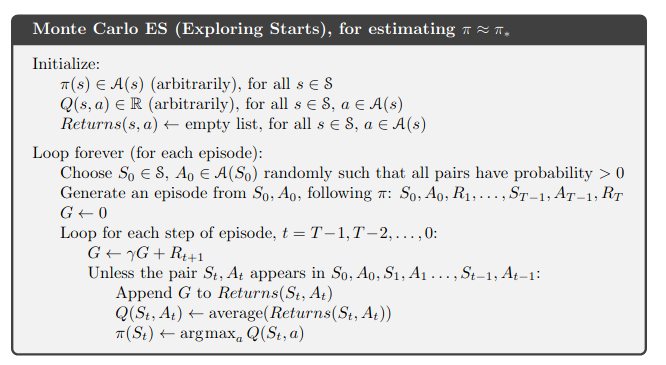

> figures are borrowed from Sutton's RL book
# Implementation of REINFORCEMENT LEARNING algorithms in the tabular setting

These algorithms are essentially based on two components :

- *policy improvement theorem* :

for 2 policy p and p' if for all states s we have :
q_p(s, p'(s)) >= q_p(s, p(s)) then
v_p'(s) >= v_p(s) for all s

- *temporal difference learning*:
The idea of using learned estimates of other states to
  learn the current state (bootstrapping)

## Q-Learning

Off-policy algorithm with an update such that q* is learnt directly

## Sarsa

On-policy algorithm using epsilon-greedy policy to
learn q*.

## Expected Sarsa

Similar to Q-learning but using the expectation of Q over actions
instead of the maximum

## Monte-Carlo es

Monte-carlo average state-action pairs sample returns to learn the optimal
state-action value function.

